# Demonstration simulations using soilice

## Heat propagation

In this simulation we solve a vertical soil profile (with massflag=1 and gravity=1), with no cryosuction, with no flow (simulateFlow=False), with advection turned on and a specified heat flux at the upper boundary (`jTopBC=2e6 # J/m2/s`). Loam soil properties are used for a homogeneous 2m deep soil profile. A uniform initial temperature of -2.5 deg C is used. We simulate a wet and dry profile with an initial $\psi=-1$ and $\psi=-10$, respectively. We run the model for 10 days, and in the figures below the results are plotted every 1.5 days. 

For full details of the model configuration see the notebook [here](01_HeatingSurface.ipynb).

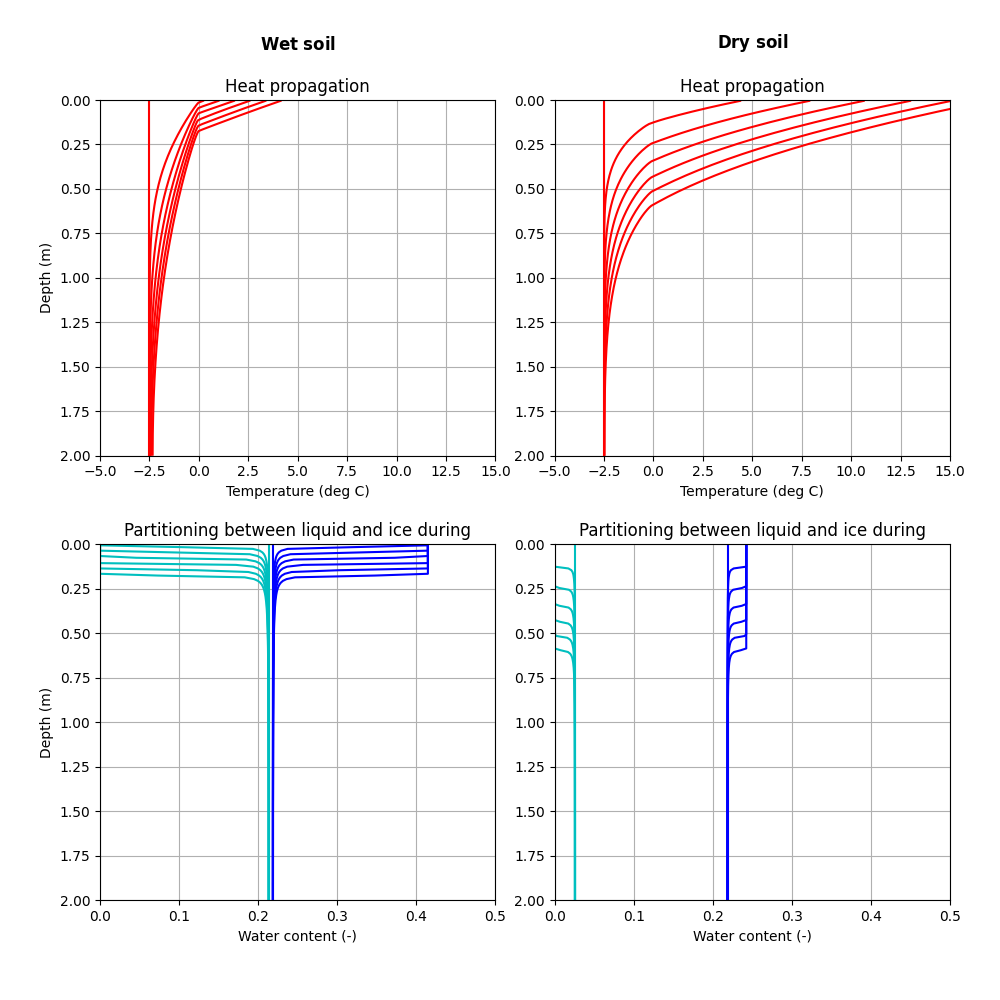

The figure shows how latent heat impacts the propagation of heat into the profile. In the wet simulation, the increasing temperature with depth is retarded by latent heat. In the dry soil there is no water to absorb latent heat, and the temperature increases are deeper. 

In the lower plots we see how the soil thaws progressively with time. In both soils, there is negligible liquid water content initially, and the soil thaws completely. The thawing propagates deeper in the drier soil, again as there is less latent heat consumption to retard the heating.

## Infiltration scenarios

In these series of simulations we explore infiltration into variable saturated and variably frozen soils. We have massflag=1, gravity=1, cryoflow=0, withadv=1. We simulate flow and heat transport. We have a 2 m deep profile with uniform loam soil properties. For all simulations we apply a constant irrigation flux of 50 mm/day for a period of 20 days. Each simulation has a different initial temperature and matric potential, and different temperature of irrigation water, described below.

Full details of these model runs are [here](02_InfiltrationPulse.ipynb).

The first simulation considers an unfrozen soil ($T_{ini}=0$) and moderate water content ($\psi=-5$) with irrigation water at $T_I=2$ deg C. This is warm rain on an unfrozen profile. The soil wets and warms, as shown.

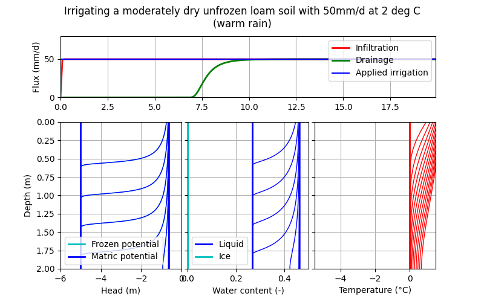

The second simulation is identical to the first, but the initial soil temperature is dropped to $T_{ini}=-1$, so that the warm rain is falling onto partially frozen soil. We see here the soil thaws as the water infiltrates. The breakthrough of drainage from the base of the soil still happens, but it is delayed compared with the first scenario. There is also no runoff generated in this scenario.

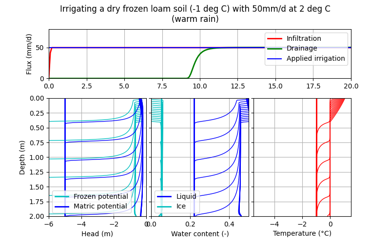

The third scenario considers a colder initially soil temperature ($T_{ini}-5$) and infiltration at $T_I=0$, representative of snowmelt. In this case the soil is not fully thawed as the water infiltrates. Ice accumulates at the ground surface, reducing the infiltration capacity, such that after about 2 days runoff is generated as not all of the irrigation can infiltrate. The drainage from the base of the soil is reduced and delayed.

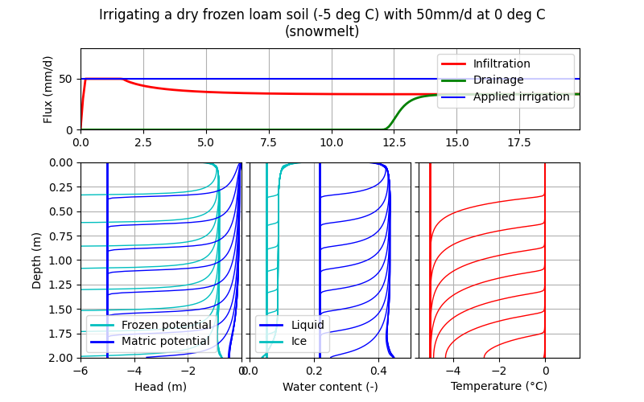

In the fourth and final scenario we keep everything the same as scenario 3, but increase the initial soil wetness by making $psi_{ini}=-1. This is now snowmelt onto an almost saturated soil. In this case, the water that does infiltrate freezes in the near surface, increasing the ice content such that the infiltration capacity becomes extremely low and there is hardly any infiltration and no drainage at all. Almost all of the irrigated water becomes runoff in this scenario - consistent with our understanding of runoff/infiltration partitioning in wet frozen soils.

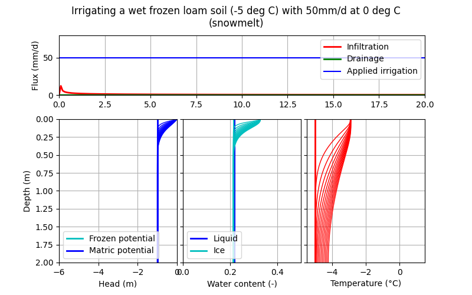

## Cryosuction demonstration

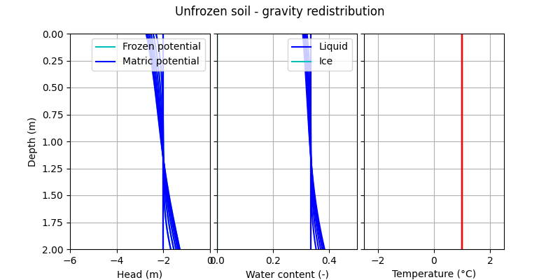
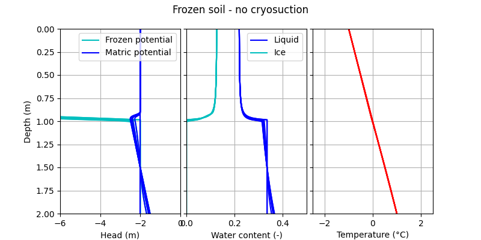
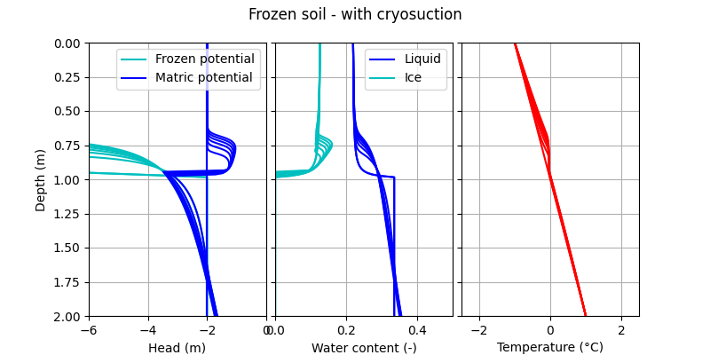

## Seasonally frozen soil simulations

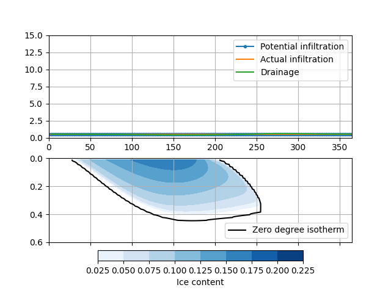
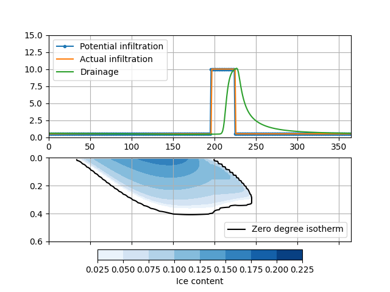
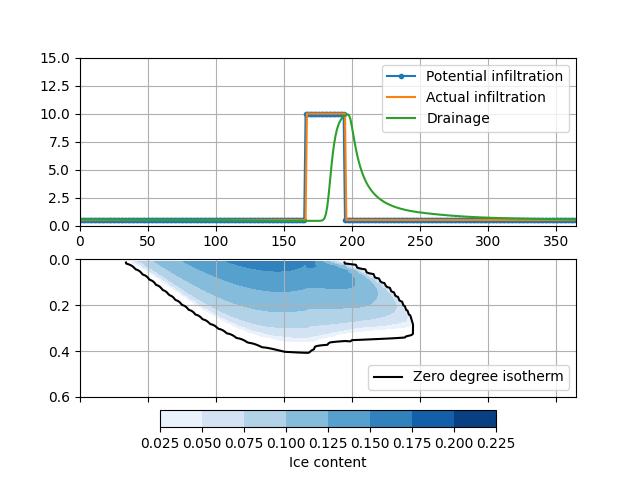

## Permafrost soil simulations

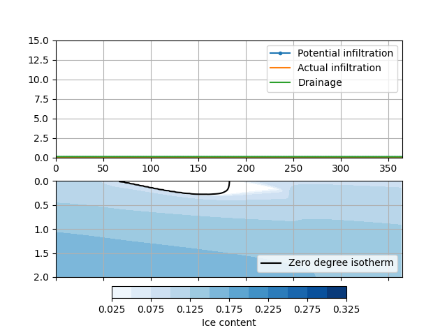
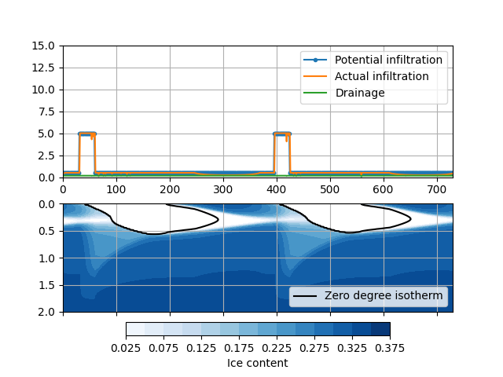