# Demonstration simulations using soilice

## Frozen soil hydraulic properties

It is important to understand that with variably saturated, variably frozen soils, the hydraulic and thermal properties are functions of two variables - that is `psie` and `T`. This first notebook is designed to plot the properties as functions of both of these varibles, which is important to do before running the model to ensure the functions are behaving as expected. For full details of the model configuration see the notebook [here](00_Properties.ipynb).

This first figure shows properties using our default functions plotted against matric potential on the x-axis, considering different fixed values of temperature:

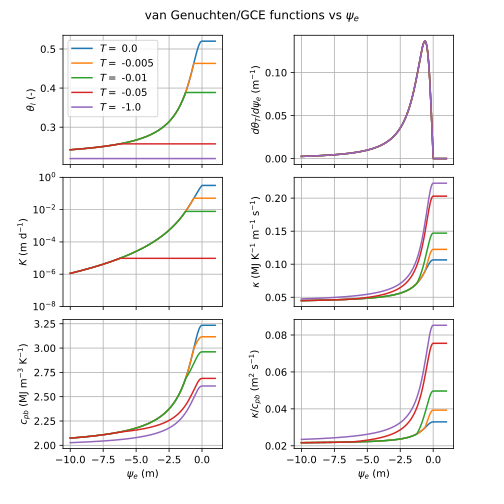

This next figure shows the same thing, but this time plotting the variables against temperature on the x-axis, considering different fixed values of `psie` (related to total water content):

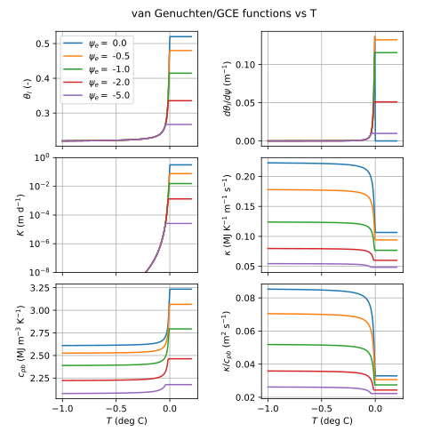

Here we demonstrate three alternative models for hydraulic conductivity (different models are different rows). The first treats hydraulic conductivity as a function of total water content, and hence ignores freezing effects on $K$ (unrealistic). The second treats hydraulic conductivity as a function of liquid water content, which is the most physically satisfying, but results in very low $K$ values that inhibit infiltration. The final model in the third row applies the widely used impedence model, with an impedence factor of 10. This generates intermediate $K$ values between the other two models, which is better for simulating infiltration, but the model is subtly non-monotonic under certain conditions, as shown in the lower left-hand plot.

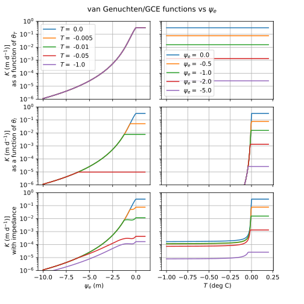

## Heat propagation

In this simulation we solve heat transport only for a vertical soil profile, subject to specified heat flux at the upper boundary (`jTopBC=2e6 # J/m2/s`). Loam soil properties are used for a homogeneous 2m deep soil profile. A uniform initial temperature of -2.5 deg C is used. We simulate a wet and dry profile with an initial $\psi=-1$ and $\psi=-10$, respectively. We run the model for 10 days, and in the figures below the results are plotted every 1.5 days. 

For full details of the model configuration see the notebook [here](01_HeatingSurface.ipynb).

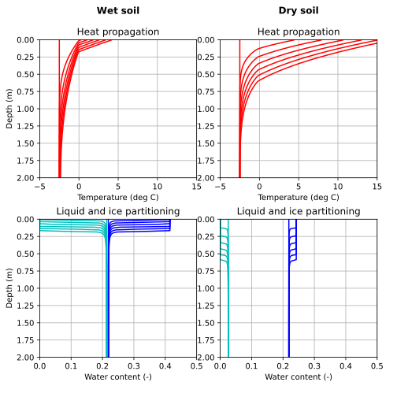

The figure shows how latent heat impacts the propagation of heat into the profile. In the wet simulation, the increasing temperature with depth is retarded by latent heat. In the dry soil there is no water to absorb latent heat, and the temperature increases are deeper. 

In the lower plots we see how the soil thaws progressively with time. In both soils, there is negligible liquid water content initially, and the soil thaws completely. The thawing propagates deeper in the drier soil, again as there is less latent heat consumption to retard the heating.

## Infiltration scenarios

In these series of simulations we explore infiltration into variable saturated and variably frozen soils. We solve simultaneous flow and heat transport and we use the impedence model for $K$. We have a 2 m deep profile with uniform loam soil properties. For all simulations we apply a constant irrigation flux of 50 mm/day for a period of 20 days. Each simulation has a different initial temperature and matric potential, and different temperature of irrigation water, described below.

Full details of these model runs are [here](02_InfiltrationPulse.ipynb).

The first simulation considers an unfrozen soil ($T_{ini}=0$) and moderate water content ($\psi=-5$) with irrigation water at $T_I=2$ deg C. This is warm rain on an unfrozen profile. The soil wets and warms, as shown.

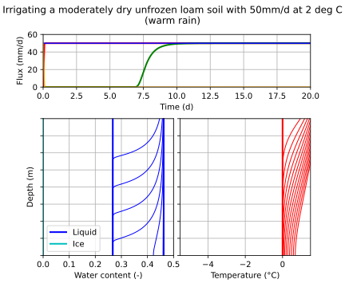

The second simulation is identical to the first, but the initial soil temperature is dropped to $T_{ini}=-1$, so that the warm rain is falling onto partially frozen soil. We see here the soil thaws as the water infiltrates. The breakthrough of drainage from the base of the soil still happens, but it is delayed compared with the first scenario. There is also no runoff generated in this scenario.

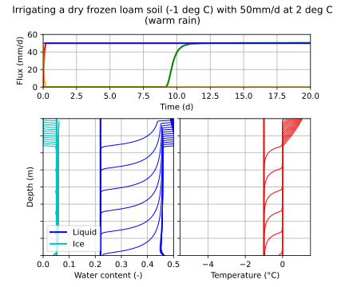

The third scenario considers a colder initially soil temperature ($T_{ini}-5$) and infiltration at $T_I=0$, representative of snowmelt. In this case the soil is not fully thawed as the water infiltrates. Ice accumulates at the ground surface, reducing the infiltration capacity, such that after about 2 days runoff is generated as not all of the irrigation can infiltrate. The drainage from the base of the soil is reduced and delayed.

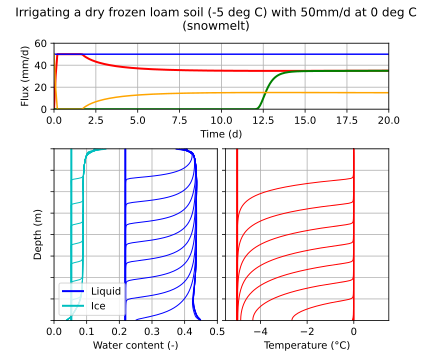

In the fourth and final scenario we keep everything the same as scenario 3, but increase the initial soil wetness by making $psi_{ini}=-1. This is now snowmelt onto an almost saturated soil. In this case, the water that does infiltrate freezes in the near surface, increasing the ice content such that the infiltration capacity becomes extremely low and there is hardly any infiltration and no drainage at all. Almost all of the irrigated water becomes runoff in this scenario - consistent with our understanding of runoff/infiltration partitioning in wet frozen soils.

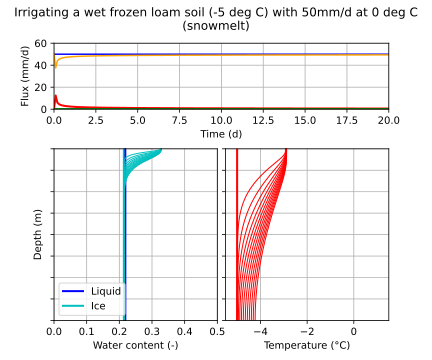

## Seasonal freeze-thaw simulations

For these two simulations, we solve heat transport only, with a sinusoidal surface heat flux, and a fixed temperature at the base of the soil profile. For the seasonally frozen soil the lower boundary is at +1 deg C, while for the permafrost soil the lower boundary is at -1 deg C, and all else is equal in the models. The results are shown in the figures below. Full details of these model runs are [here](03_SeasonalFreezeThaw.ipynb).

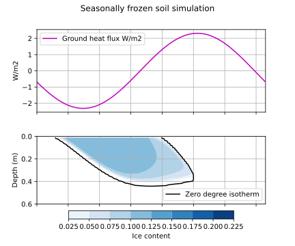
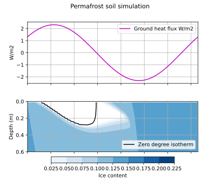

## Cryosuction demonstration

These simulations consider flow and heat transport in a 1 m soil profile with a fixed temperature at the top and bottom of the profile and no mass fluxes across the top or bottom boundary. Full details of these model runs are [here](04_Cryosuction.ipynb).

Initially we consider unfrozen conditions, and the model simulates the gravity redistribution of water in the profile, as shown here:

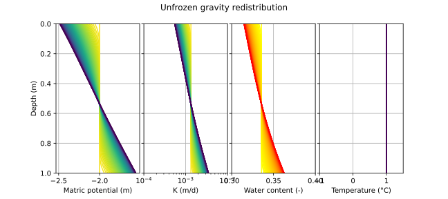

In the next two simulations we consider a top and bottom temperature of -1 and +1 deg C, respectively, such that the upper 0.5 m of the domain is initially frozen. In both cases, the hydraulic conductivity is calculated from the liquid water content (row 2 in the figure above). In the first case, we assume the hydraulic gradient does not include cryosuction - that is it is based on the difference in `psie`, which is not directly affected by freezing. The result shows that in the frozen zone there is minimal redistribution of water, since $K$ and the gradient in the frozen zone are small. This effectively makes the frozen soil impermeable, and water remains stuck in place until it thaws.

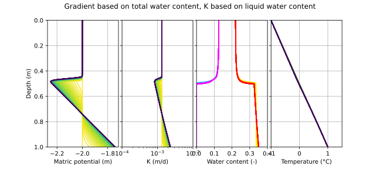

In the final case, we now calculate the hydraulic gradient based on the differences in `psif`, that is the frozen matric potential. This is accounting for the phenomenon of 'cryosuction'. This time, due to the cold temperatures, we generate very low matric potentials, and hence very large hydraulic gradients. However, the $K$ is also very low. There is a sweet spot near the frozen front where the combination of a high gradient and a relatively high $K$ value result in the migration of water, and we see water accumulating at the freezing front. This is the phenomenon experienced in many field conditions, that can ultimately lead to frost heave. 

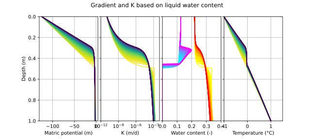

